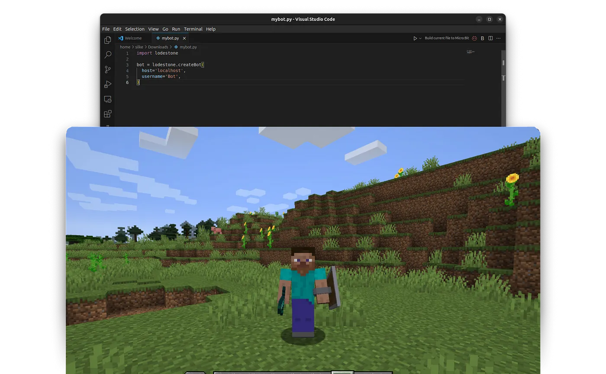

<file-attachment-contents filename="README.md">

<h1 align="center">
  <br>
  <a href="https://github.com/SilkePilon/lodestone/"></a>
  <br>
</h1>

<h4 align="center">🤖 Create Minecraft bots with a powerful, stable, and high level Python API </h4>

<p align="center">
    
      <a href="https://python.org/"></a>
  <a href="https://github.com/reworkd/AgentGPT/blob/master/docs/README.zh-HANS.md"></a>
  <a href="soon!"></a>
</p>

<!--  -->

## About 

Lodestone is an incredibly powerful and flexible framework for building Minecraft bots of all kinds.
Whether you’re new to Minecraft bot development or a seasoned pro, Lodestone provides all the tools you need to bring your bot ideas to life.
Let’s dive into how to get up and running with Lodestone.

## Features

*  Supports Minecraft 1.8, 1.9, 1.10, 1.11, 1.12, 1.13, 1.14, 1.15, 1.16, 1.17, 1.18, 1.19 and 1.20.1.
*  Entity knowledge and tracking.
*  Block knowledge. You can query the world around you. Milliseconds to find any block.
*  Physics and movement - handle all bounding boxes
*  Attacking entities and using vehicles.
*  Inventory management.
*  Crafting, chests, dispensers, enchantment tables.
*  Digging and building.
*  Miscellaneous stuff such as knowing your health and whether it is raining.
*  Activating blocks and using items.
*  Chat.
*  Plugins for many servers.

## Getting Started 

> [!IMPORTANT]
> Some parts of the code are still in development and do not work!

All instalation instructons and documentation can be found [here](https://lodestone-documentation.vercel.app/ "docs")<br> but here is the general idea.

#### Installation and Setup
The first step is to install the Lodestone package using pip. It’s recommended to create a virtual environment first before installing:
```bash
python3 -m venv env
source env/bin/activate
pip install lodestone
```
With Lodestone installed, create a bot.py file to initialize your bot. This is where you’ll configure your bot’s username, authentication method, and other options:
```python
import lodestone
bot = lodestone.createBot(
  host='localhost',
  port=25565,  # set this to your own LAN port
  username='MyAwesomeBot',
  auth='microsoft' 
)
```
In this example, we’re connecting to a local Minecraft server on localhost and using Microsoft authentication.

##### Running and Logging In
With your bot created, run it using:
```bash
python bot.py
```
The first time you run your bot, Lodestone will prompt you to log in using the authentication method you configured. Follow the login prompts to authenticate your bot and connect it to the Minecraft server.
Lodestone provides multiple authentication options including Microsoft and Offline modes. See the docs for details.


### Uisng the Lodestone CLI

Lodestone also offers an easy to use command line intercace (CLI). This allows you to use the basic functions of lodestone.
the CLI offers auto tab complete and has real time chat logs.

> [!IMPORTANT]
> `username` and `host` are requierd options. 

> [!WARNING]
> Do not share your Minecraft info to anyone. 

<details open>
<summary>Command line arguments</summary>
<br>

The command line arguments available are:

* `--username` or `-u`: The Minecraft username the bot will log into. 
* `--host` or `-h`: The IP address or hostname of the Minecraft server. 
* `--port` or `-p`: The port number the Minecraft server is listening on. Default is 25565. 
* `--auth`: The authentication method your account requires (mojang/microsoft/cracked). Default is "microsoft". 
* `--version` or `-v` : Minecraft version to use when connecting to a server. Default is auto. 

</details>

## Contributors 
| Name                | Helped With                               | GitHub   | Discord   |
| --------------------- | ----------------------------------------- | ----------- | ----------- |
| **Katzengott**            | fishing bot and cactus bot | [@Katzengott](https://github.com/Katzengott) | edelkatze |


## Roadmap

- [ ] Add config.json file
- [X] Add [click](https://github.com/pallets/click)
- [X] Change to use as Pip package for better use
- [X] Add Discord integration
- [ ] Add Custom code runner (a way for users to test their own bot code in a nice and simple way)

## MineFlayer 🚀

Mineflayer is a complex library that allows you to control Minecraft accounts through a powerful, stable, and high-level JavaScript API

## Discord

https://discord.gg/Fa7HZgkczz

## Credits

<a href="https://github.com/PrismarineJS/mineflayer" target="_blank">MineFlayer</a>

---

Screenshots:
[Dashboard](https://imgur.com/a/Hceiwhp)
[Settings](https://imgur.com/a/9p1YbtE)

</file-attachment-contents>
